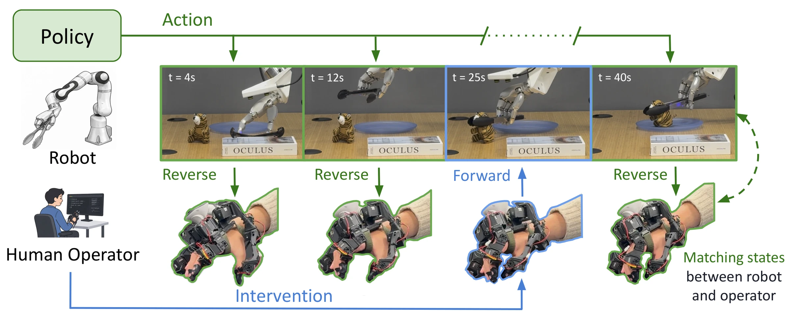

<h1 align="center">DITTO-X: Forward and Reverse Teleoperation for Dexterous Manipulation and Human Intervention</h1>

  <a href="https://zhanpenghe.github.io/">Zhanpeng He</a>1,* &nbsp;&nbsp;
  <a href="https://joaquinpalacios.com/">Joaquin Palacios</a>2,* &nbsp;&nbsp;
  <a href="https://zywang-j.github.io/">Zhangyu Wang</a>1 &nbsp;&nbsp;
  <a href="https://chenhaoli.xyz/">Chenhao Li</a>1 &nbsp;&nbsp;
  <a href="https://katelynlee.github.io/">Katelyn Lee</a>2  
  <a href="https://www.me.columbia.edu/faculty/matei-ciocarlie">Matei Ciocarlie</a>2,&dagger; &nbsp;&nbsp;
  <a href="https://profiles.stanford.edu/c-karen-liu">C. Karen Liu</a>1,&dagger; &nbsp;&nbsp;
  <a href="https://jiajunwu.com/">Jiajun Wu</a>1,&dagger;

  1 Stanford University &nbsp; 2 Columbia University &nbsp; * Equal contribution &nbsp; &dagger; Equal advising

  
  

Code, hardware guide and the DITTO-Human Dataset coming soon.

  

